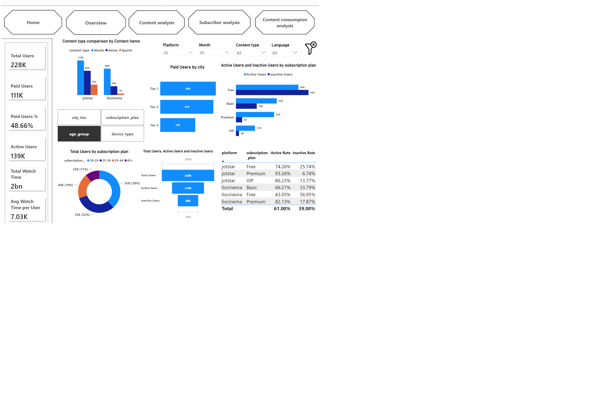

# Jotstar-LioCinema Power BI Analysis

## 📊 Project Overview

Power BI analysis of Jotstar and LioCinema OTT platforms, focusing on user behavior, subscriptions, content library, and content consumption.

The dashboard provides an interactive view of platform performance and helps identify user engagement, subscription trends, and content consumption patterns.

## 🎯 Business Objective

The objective of this project is to analyze subscriber and content data from Jotstar and LioCinema and derive insights that can support strategic decisions related to:

- User engagement and retention
- Subscription performance
- Content strategy
- Platform comparison
- Content consumption behavior

## 🛠️ Tools & Technologies

- Power BI
- DAX
- Power Query
- MySQL
- Git & GitHub

## 📑 Dashboard Pages

### 1. Overview
Provides a high-level comparison of users, paid subscribers, active/inactive users, subscription plans, and platform performance.

### 2. Content Analysis
Analyzes content types, genres, languages, and total content/runtime across both platforms.

### 3. Subscriber Analysis
Analyzes subscription plans, device usage, and user upgrade/downgrade behavior.

### 4. Content Consumption Analysis
Analyzes watch time across platforms, devices, age groups, and months.

## 🔍 Key Insights

- The combined dataset contains approximately **228K users**.
- Approximately **111K users are paid subscribers**.
- Overall user activity is around **61%**, with approximately 139K active users.
- Movies form the largest content category in the combined content library.
- Mobile, laptop, and TV usage provide different patterns of content consumption across the platforms.
- The dashboard highlights differences in subscriber behavior and engagement between Jotstar and LioCinema.

## 📸 Dashboard Preview



## 📁 Project Structure

```text
Jotstar-LioCinema-PowerBI-Analysis/
│
├── Dataset/
├── PowerBI/
│   ├── Jotstar-LioCinema-PowerBI-Analysis.pbip
│   ├── Jotstar-LioCinema-PowerBI-Analysis.Report/
│   └── Jotstar-LioCinema-PowerBI-Analysis.SemanticModel/
│
├── .gitignore
└── README.md
